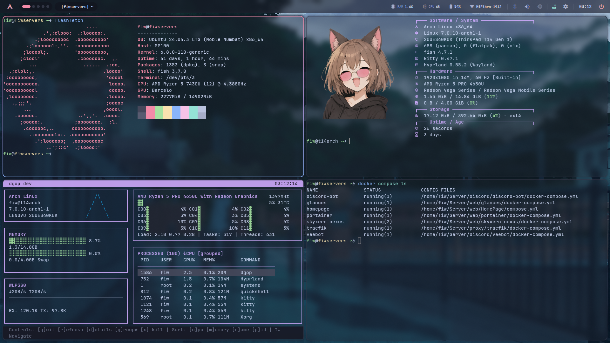

# Alex / Fi3w0

> 🌙 just a guy who loves Linux, building things, and occasionally breaking them

**OS & Systems**

**Infrastructure & DevOps**

**Learning / Exploring**

**Languages & Scripting** *(by hand)*

---

---

## 👋 About

I'm Fiw. I am an AI-assisted systems developer. I build some Linux infrastructure stuff, custom desktop environments, and Minecraft server utilities. Or any shit that comes to my head.

I write Bash, Go, Lua, Python, and server configurations by hand. For heavier application codebases (Rust, Swift, Kotlin), I design the architecture and direct automated AI agent loops to scale my output. The bots type the boilerplate; I handle the low-level hardware debugging, system integrations, and final reviews myself.

**Pronouns:** he/him · **Username:** fi3w0 *(fi·three·wo)*

---

## ⚙️ Stack

| Area | Tools |
|---|---|
| **OS** | Gentoo · Arch Linux · macOS · Ubuntu Server LTS |
| **Infra** | Docker · Compose · Traefik · GitHub Actions |
| **By hand** | Bash · Go · Lua · Java · Python |
| **AI-directed** | Rust · Swift · Kotlin · TypeScript · QML |
| **Next up** | Kubernetes · Terraform · Ansible |

Daily machines: MacBook Air M4 (main), dual-boot desktop for gaming/heavy loads, ThinkPad T14 (Gentoo/Arch/NixOS testing rig and main Linux horse).

---

## 🛠️ Projects

### Heavy Systems / R&D
**[TideWM](https://github.com/Fi3w0/TideWM)**: A water-themed Wayland compositor in Rust on Smithay. Tiling (BSP/master-stack), multi-monitor, XWayland, workspaces, and a custom Scorium (`.wave`) configuration engine.
**[Scorium](https://github.com/Fi3w0/Scorium)**: Readable on the surface, programmable when you need it. A sandboxed, embeddable, Lua-powered configuration engine for Rust. It features native typed values (colors, durations) and opt-in logic.
**[Moonlit Shell](https://github.com/Fi3w0/Moonlit-shell)**: Handcrafted Arch + Hyprland desktop with a custom Quickshell (QML/Qt6) interface. Twelve native panels, one Catppuccin Mocha theme throughout, zero monitoring daemons.
**[Flux](https://github.com/Fi3w0/Flux)**: Native macOS media workbench. Convert, download, edit, and compose media in one app, built on SwiftUI + AppKit over FFmpeg and yt-dlp. Fully local.

### In Production / Live
**[FIW Bosses](https://github.com/Fi3w0/Fiw-Bosses)**: JSON-driven, multi-loader (Fabric/NeoForge/Forge) boss framework with thousands of downloads on Modrinth. 50+ abilities, HP-phases, custom minions, dialogue, loot, hot reload. Used by real server admins.
**[FIW Tools](https://github.com/Fi3w0/Fiw-Tools)**: Sibling mod to FIW Bosses. Server-side, JSON-only custom items: weapons, armor, curses, and an imbuing engine. Vanilla clients connect fine.

More at [fiwlabs.dev](https://fiwlabs.dev) and [github.com/Fi3w0?tab=repositories](https://github.com/Fi3w0?tab=repositories).

---

## 🤝 Contributing & Code Reviews

Because I balance this with study and use an AI-assisted workflow, my time to manually review massive pull requests is limited. If you want to contribute, please keep PRs small, targeted, and tested on real hardware. I test everything myself before merging. <3

---

## 🔭 Currently

Finishing my DevOps course · coming back to Kubernetes/Terraform/Ansible when there's time · using Go for manual automation and CLI tooling · learning Gentoo.

<b>🎭 How I Work</b>

 

- **DevOps**: Docker, CI/CD, reverse proxies, and server automation are my daily stuff.
- **Integrator**: I design the schemas, map out the features, and ensure the whole system talks to each other at least at some lvl.
- **Builder**: I use every tool available to me—manual code, AI loops, and terminal debugging—to ship software that people actually use.
- **Dev**: I build stuff (yea that is true)

---

## 🌍 Languages

Ukrainian · Russian *(native)*, Spanish *(native-level)*, English *(C1)*

---

## 📫 Connect

Open to collaborative projects, learning, and anything Linux or infrastructure related.

Gentoo · Arch Linux · Docker · SSH · Terminal · Always learning
