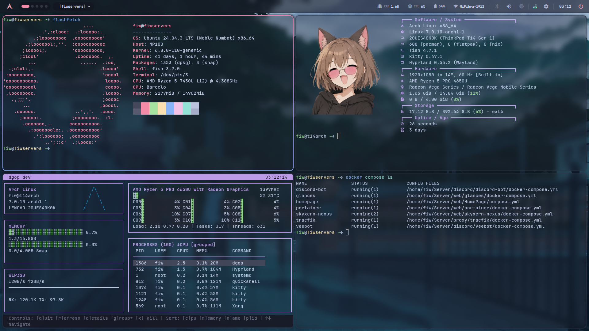

# Alex / Fi3w0

**🌙 just a guy who loves Linux, building things, and occasionally breaking them**

DevOps · Gentoo on the desktop · Wayland compositors · Qt apps · Minecraft server tooling

---

## 👋 About

I'm Fiw. I build Linux infrastructure stuff, custom desktop environments, and Minecraft server utilities. Or any shit that comes to my head.

- **Favourite toolkit:** Qt 💚 (Qt 6 / QML): FiwNode, Apdatifier Gentoo.
- **Setup:** Gentoo + KDE Plasma on a Ryzen 9 9900X / RTX 3060 desktop with my own CachyOS-patched kernel; MacBook Air M4 as my main laptop; ThinkPad T14 on Arch.
- **Homelab:** Ubuntu Server with Docker and Traefik running my Minecraft servers, Discord bots and dashboards.
- **Pronouns:** he/him · **Username:** fi3w0 *(fi·three·wo)*

---

## 🛠️ Projects

<table>
<tr>
<td width="50%" valign="top">

### 🌊 [TideWM](https://github.com/Fi3w0/TideWM)
A Wayland desktop that feels like water. Real tiling WM in Rust on Smithay: ripples, waves, frosted glass, an infinite Ocean canvas, and a hot-reloaded `.wave` config.

</td>
<td width="50%" valign="top">

### 🐧 [Fiw-Gentoo-Dots](https://github.com/Fi3w0/Fiw-Gentoo-Dots)
My Gentoo restore kit: KDE style and keybinds, categorized packages, optional app configs, and my CachyOS-patched kernel, picked through a TUI with a preview and backups.

</td>
</tr>
</table>

| Project | What it is | Stack |
|---|---|---|
| [FIW Bosses](https://github.com/Fi3w0/Fiw-Bosses) | JSON boss framework for Fabric/NeoForge/Forge: phases, 50+ abilities, minions, hot reload. Thousands of downloads on Modrinth | Java |
| [FIW Tools](https://github.com/Fi3w0/Fiw-Tools) | Server-side JSON custom items, curses and imbuing. Vanilla clients connect fine | Kotlin |
| [Scorium](https://github.com/Scorium-lang) | Config language: plain data on the surface, sandboxed logic when you need it. Spec + native [Rust](https://github.com/Scorium-lang/scorium-rs) · [Go](https://github.com/Scorium-lang/scorium-go) · [TS](https://github.com/Scorium-lang/scorium-js) · [JVM](https://github.com/Scorium-lang/scorium-jvm) implementations | Rust · Go · TS · Java |
| [FiwNode](https://github.com/Fi3w0/FiwNode) | PipeWire soundboard: your mic + sound effects in one virtual microphone | Rust · Qt 6 |
| [Nereus](https://github.com/Fi3w0/Nereus) | Final DevOps project: k3s, CI/CD, blue-green deploys that roll themselves back, observability | Go · k3s |
| [Moonlit Shell](https://github.com/Fi3w0/Moonlit-shell) | Arch + Hyprland desktop with a custom Quickshell UI | QML · Go |

**Smaller stuff:** [Admin Tools](https://github.com/Fi3w0/fiw-admin-utilitys) · [AntiCheat](https://github.com/Fi3w0/Fiw-Anticheat) · [Tickwatch](https://github.com/Fi3w0/Fiw-Clock) · [Warp](https://github.com/Fi3w0/Fiw-Warp) · [Graves](https://github.com/Fi3w0/Fiw-Graves) · [Apdatifier Gentoo](https://github.com/Fi3w0/apdatifier-gentoo) · [Flux](https://github.com/Fi3w0/Flux) · [AquaTTY](https://github.com/Fi3w0/AquaTTY)

Check out [fiwlabs.dev](https://fiwlabs.dev) and my other projects in [all repositories](https://github.com/Fi3w0?tab=repositories).

---

## ⚙️ Stack

| | |
|---|---|
| **OS** |     |
| **Infra** |       |
| **By hand** |     |
| **With agents** |       |
| **Revisiting** |     |

---

## 🔭 Currently

Running Gentoo and still learning it · building TideWM · using Go for automation and CLI tooling · coming back to Terraform/Ansible when there's time.

## 🧭 How I work

- **DevOps**: Docker, CI/CD, reverse proxies, and server automation are my daily stuff.
- **Integrator**: I design the schemas, map out the features, and make sure the whole system talks to each other, at least at some lvl.
- **Builder**: manual code, AI loops, and terminal debugging, whatever ships software people actually use.
- **Dev**: I build stuff (yea that is true)

<b>On AI</b>

 

On the bigger codebases (Rust, Kotlin, Java, Swift, QML) coding agents like Claude Code and Codex write most of the code, while I set the architecture and direction. I don't manually review every line they write; I focus on system behavior, integration, tests, performance and debugging on real hardware. Pushing, publishing and scope stay my call.

## 🤝 Contributing

I balance this with study, so my time to review big PRs is limited. Keep PRs small, targeted, and tested in the relevant environment. I test everything myself before merging. <3

## 🌍 Languages

Ukrainian · Russian *(native)* · Spanish *(native-level)* · English *(C1)*

---

Gentoo · Arch Linux · Docker · SSH · Terminal · Always learning

